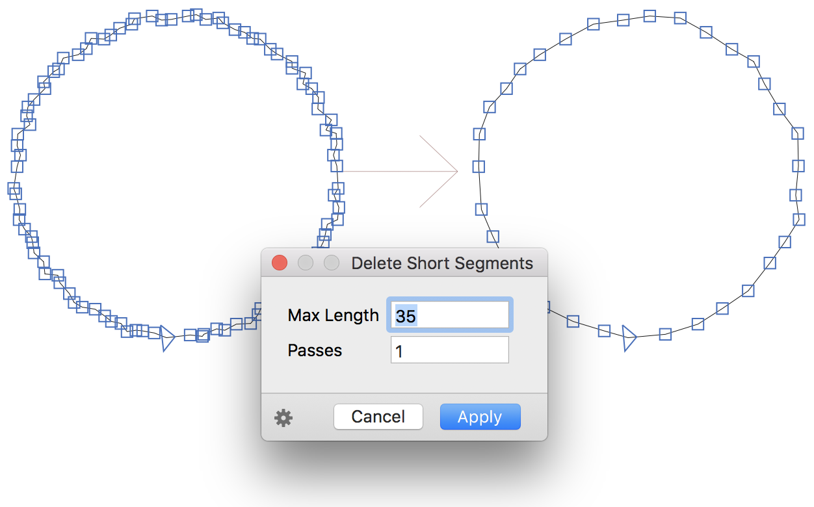

# DeleteShortSegments.glyphsFilter

This is a plugin for the [Glyphs font editor](http://glyphsapp.com/) by Georg Seifert. After installation, it will add the menu item *Filter > Delete Short Segments* (de: *Kurze Segmente löschen*). You can set a keyboard shortcut in System Preferences.

*Filter > Delete Short Segments* deletes line segments from your paths that are shorter than 1 unit. (Or, more precisely, if both x and y distances of the segment are shorter than 1 unit.) This can be very useful for cleaning up roughened paths when you have a grid step finer than 1 unit.

### Installation

1. One-click install *DeleteShortSegments* from *Window > Plugin Manager*
2. Restart Glyphs.

or: 

1. Download the complete ZIP file and unpack it, or clone the repository.
2. Double click the .glyphsFilter file. Confirm the dialog that appears in Glyphs.
3. Restart Glyphs

### Usage Instructions

1. Open a glyph in Edit View.
2. Use *Filter > Delete Short Segments* remove short segments.

### Custom Parameter

You can trigger the filter at export time with a custom parameter in *File > Font Info > Instances:*

    Property: Filter
    Value: DeleteShortSegments;

Or with any of the `maxlength` and `passes` options:

    Property: Filter
    Value: DeleteShortSegments; maxlength: 3; passes: 1

`maxlength` is the default threshold size (in units) below which the segment will be deleted. Default: 1 unit. 

`passes` is the amount of times the filter goes through all your paths. By default, the filter goes *twice* through your paths. A single pass sometimes misses a few cases, especially if a couple of short segments follow each other.

### Requirements

The plugin needs Glyphs 2.4.1 or higher, running on OS X 10.9 or later. It does NOT work with Glyphs 1.x.

### License

Copyright 2017 Rainer Erich Scheichelbauer (@mekkablue).
Based on sample code by Georg Seifert (@schriftgestalt) and Jan Gerner (@yanone).

Licensed under the Apache License, Version 2.0 (the "License");
you may not use this file except in compliance with the License.
You may obtain a copy of the License at

http://www.apache.org/licenses/LICENSE-2.0

See the License file included in this repository for further details.
